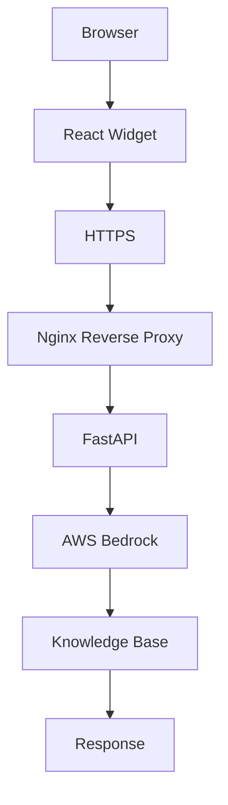

# ASK Vera

ASK Vera is an AWS-native FastAPI chatbot backend for a public website widget. It uses IAM instance-role authentication only, Bedrock Knowledge Bases for RAG-only answers, Comprehend for PII scrubbing, RDS PostgreSQL for sessions and consent, ElastiCache Valkey for response caching, Kinesis Firehose for audit logs, and SQS for feedback.

## Production Deployment

The production deployment is live on AWS EC2 behind Nginx and HTTPS.

- Production API: `https://api.vera-api.xyz`
- Widget domain: `https://chat.vera-api.xyz`
- Runtime user: `askvera`
- Service manager: `systemd`
- TLS: Let's Encrypt certificate installed through `deployment/ssl/certbot.sh`
- DNS: Porkbun/Cloudflare records point the API and widget hostnames to the production entry points.



## Project Structure

- `api/` - FastAPI routes and middleware.
- `services/` - Bedrock, Valkey, PostgreSQL, Comprehend, Firehose, SQS, consent, session, and guardrail logic.
- `config/` - Non-secret settings, persona, and denied topic definitions.
- `utils/` - Structured logging, typed exceptions, and Pydantic models.
- `tests/` - Unit and gated integration tests.
- `scripts/validate_config.py` - Fails fast when required settings are missing.
- `deployment/` - Repeatable EC2, Nginx, systemd, SSL, health check, and rollback assets.
- `main.py` - App entry point for Uvicorn.
- `widget-wrapper/` - Reusable React + TypeScript widget wrapper package for embedding any assistant, iframe, script widget, or message feed.
- `admin-portal/` - Operations portal for live pipeline traces, approved-document ingestion, and experience analytics.

## Generic Widget Wrapper

The reusable frontend shell lives in `widget-wrapper/` so the full ASK Vera project stays together in this folder. It exports `GenericWidgetWrapper` and `PlainStateGenericWidgetWrapper`, accepts all visible content through config/props, and contains no brand-specific implementation copy. See `widget-wrapper/README.md` for mock chatbot, iframe, and script embed examples.

## Operations Portal

The responsive operations interface lives in `admin-portal/`. It can replay a recent question through the answer pipeline, upload approved policies, product information, training, FAQ, marketing, legal, or operations documents, and review usage and answer-quality analytics by market and language. The portal uses realistic demo data when disconnected and switches to authenticated live APIs when an admin key is supplied. See `docs/OPERATIONS_PORTAL.md` for the data model, security controls, and deployment checklist.

## IAM Authentication

No AWS credentials are stored on disk. Boto3 clients are created without explicit keys and use the EC2 instance role `ChatbotAppRole`. Do not add `.env`, credential files, access keys, or secret JSON files. Production settings are loaded from SSM Parameter Store under `/askverachat/prod/` at startup, then RDS credentials are fetched from AWS Secrets Manager using the instance role and held in memory. Valkey uses IAM authentication with the configured Redis user.

## SSM Parameters

Production can override `config/settings.py` with SSM parameters under `/askverachat/prod/`. Current expected keys include:

- `AWS_REGION`
- `RDS_SECRET_ARN`
- `REDIS_HOST`
- `REDIS_PORT`
- `REDIS_USER`
- `BEDROCK_KB_ID`
- `BEDROCK_DATA_SOURCE_ID` / `BEDROCK_DATASOURCE_ID`
- `BEDROCK_MODEL_ARN`
- `BEDROCK_GUARDRAIL_ID`
- `BEDROCK_GUARDRAIL_VERSION`
- `FIREHOSE_STREAM_NAME`
- `SQS_FEEDBACK_QUEUE_URL`
- `S3_BUCKET`

Production SSM path:

```text
/askverachat/prod/
```

## Configure

Current dev/QA values already configured:

- `AWS_REGION = us-east-1`
- `RDS_DB_IDENTIFIER = database-1`
- `RDS_SECRET_ARN = arn:aws:secretsmanager:us-east-1:615592621509:secret:rds!db-617fcf32-1ae3-4f45-b803-4378b966fcf6-0xz7wN`
- Valkey cache name is `askverachat-cache`, endpoint is `master.askverachat-cache.iivrdz.use1.cache.amazonaws.com:6379`, and Redis user is `askverachat-app-user`.

Fill remaining placeholders in `config/settings.py` after AWS setup is complete. Run:

```bash
python scripts/validate_config.py
```

The app refuses to start unless the currently required foundation values are present. Bedrock Knowledge Base/model/guardrail ID and SQS placeholders are allowed during dev/QA until those resources are created.

## Run Locally

For unit tests, AWS calls are mocked. For the app, use a real AWS environment or mocks around `services.aws_clients`.

```bash
python -m pip install -r requirements.txt
make test
make validate-config
make run
```

## Deploy

Deploy on EC2 with `ChatbotAppRole`, Nginx, systemd, and HTTPS. Health checks must use `GET /health`, which makes no AWS calls. Use `GET /health/deep` for PostgreSQL, Redis, and dependency diagnostics.

Repeatable deployment assets live in `deployment/`:

```bash
sudo ./deployment/bootstrap.sh
sudo EMAIL=you@example.com ./deployment/ssl/certbot.sh
sudo ./deployment/deploy.sh
```

See `deployment/README.md` before running these on EC2.

## CORS

Production CORS allows:

- `https://chat.vera-api.xyz`
- `https://vera-api.xyz`

Local widget development origins are intentionally allowed:

- `http://127.0.0.1:5174`
- `http://localhost:5174`
- `http://127.0.0.1:5175`
- `http://localhost:5175`

## Tests

`make test` runs unit tests with coverage. Integration tests are skipped unless `INTEGRATION_TEST=true`.
