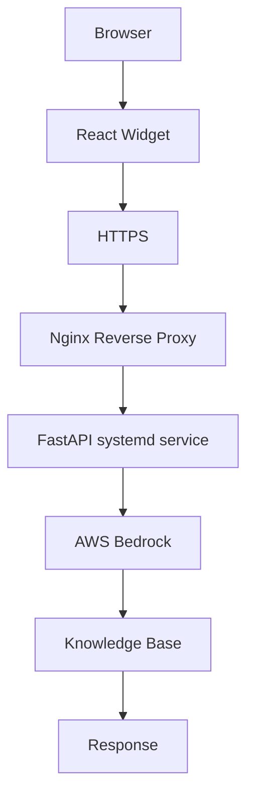

# ASK Vera Deployment

This folder contains repeatable deployment assets for the EC2-hosted FastAPI API.

Production API: `https://api.vera-api.xyz`

Widget host: `https://chat.vera-api.xyz`

Production runtime configuration should come from IAM, SSM Parameter Store, and Secrets Manager. Do not place AWS access keys, database passwords, private certificates, or Redis passwords in this folder.

## Files

- `bootstrap.sh` - prepares a fresh Ubuntu/Debian or Amazon Linux EC2 instance.
- `deploy.sh` - pulls the latest code, installs dependencies, validates config, restarts the service, and checks health.
- `rollback.sh` - rolls back to a previous Git revision and restarts the service.
- `healthcheck.sh` - checks `/health` and `/health/deep`.
- `production.env.example` - non-secret runtime environment template.
- `nginx/askvera.conf` - production reverse proxy for `api.vera-api.xyz`.
- `systemd/askvera.service` - systemd unit for Uvicorn.
- `ssl/certbot.sh` - Certbot automation for the API domain.

## First-Time EC2 Setup

```bash
chmod +x deployment/*.sh deployment/ssl/*.sh
sudo REPO_URL=https://github.com/Aspire-coder/askvera.git ./deployment/bootstrap.sh
sudo EMAIL=you@example.com ./deployment/ssl/certbot.sh
sudo ./deployment/deploy.sh
```

`bootstrap.sh` does not enable the HTTPS Nginx site because the certificate does not exist yet. `ssl/certbot.sh` installs a temporary HTTP proxy, obtains the certificate, then installs the production HTTPS config.

## Production Architecture



DNS is managed through Porkbun/Cloudflare. `api.vera-api.xyz` terminates HTTPS at Nginx on EC2, then proxies to Uvicorn on `127.0.0.1:8000`.

## Normal Deploy

```bash
sudo ./deployment/deploy.sh
```

## Health Check

```bash
sudo ./deployment/healthcheck.sh
sudo PUBLIC_URL=https://api.vera-api.xyz ./deployment/healthcheck.sh
```

## Service Operations

```bash
sudo systemctl status askvera --no-pager
sudo systemctl restart askvera
sudo journalctl -u askvera -f
```

## Nginx Operations

```bash
sudo nginx -t
sudo systemctl reload nginx
sudo tail -f /var/log/nginx/access.log /var/log/nginx/error.log
```

## Rollback

```bash
sudo ./deployment/rollback.sh HEAD~1
sudo ./deployment/rollback.sh v1.0.0-beta
sudo ./deployment/rollback.sh 4380931
```

## Widget Deployment

The widget is built separately and deployed to static hosting for `chat.vera-api.xyz`. The production widget should call `https://api.vera-api.xyz`.

```bash
cd widget-wrapper
npm ci
npm run build
npm run validate-widget
```

## Publishing Approved Knowledge

For a production source replacement, rotate the answer-cache namespace only
after the complete active load succeeds:

```bash
python -B scripts/ingestion/load_policy_sections_to_opensearch.py \
  --jsonl /path/to/document.sections.jsonl \
  --source-uri-prefix s3://approved-bucket/path \
  --status active \
  --replace-source \
  --publish-kb-version auto

sudo systemctl restart askvera
```

The EC2 role needs `ssm:PutParameter` only for the configured
`/askverachat/prod/KB_VERSION` parameter. Staging loads and failed replacements
never rotate the version. Roll back by restoring the previous approved source
and previous `KB_VERSION`, then restart the API.
