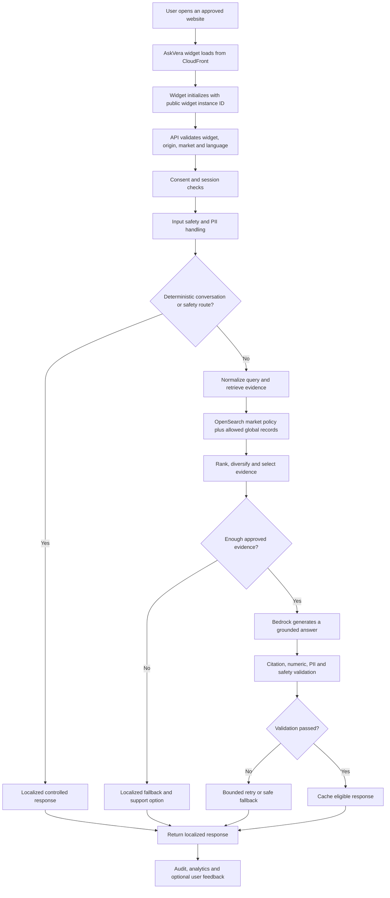
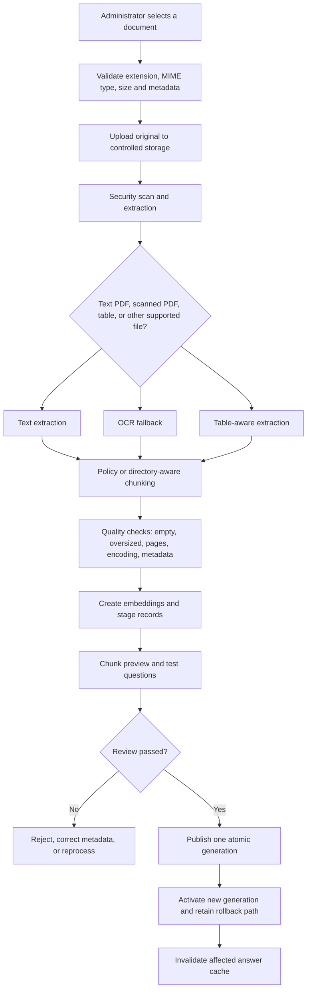

# AskVera Complete Project Handoff

Last updated: 2026-08-14

This document is the starting point for a new developer, a new Codex task, or a future AskVera maintenance session. It explains where the code lives, how the system works, how to test and publish changes, and how to recover safely when something fails.

> Security note: Never place passwords, API keys, verification codes, session tokens, AWS credentials, private email content, or secret values in this file, GitHub, screenshots, or chat messages. Runtime secrets belong in AWS Systems Manager Parameter Store or AWS Secrets Manager.

## 1. Start Here

### Source repositories on this computer

The project has appeared in more than one local folder. Confirm which copy you are editing before making changes.

| Purpose | Path |
|---|---|
| Active development workspace used by Codex | `C:\Users\KRISH\Downloads\Chatbot\Archives\enterprise-chatbot\askvera-deploy` |
| Canonical GitHub Desktop clone | `C:\Users\KRISH\Documents\GitHub\askvera` |
| Parent archive/workspace | `C:\Users\KRISH\Downloads\Chatbot\Archives\enterprise-chatbot` |
| EC2 deployment checkout | `/opt/askvera` |

The GitHub repository is:

- Repository: `https://github.com/Aspire-coder/askvera`
- Main branch: `main`
- Main CI workflow: `ASK Vera CI`

Before editing, verify the repository root contains folders such as `api`, `app`, `services`, `config`, `tests`, `widget-wrapper`, and `admin-portal`.

### Live addresses

| Component | Address |
|---|---|
| AskVera API | `https://api.vera-api.xyz` |
| Operations portal | `https://operations.vera-api.xyz` |
| Widget stylesheet | `https://d1wzljalfbhsv7.cloudfront.net/widget/latest/widget.css` |
| Widget JavaScript | `https://d1wzljalfbhsv7.cloudfront.net/widget/latest/widget.js` |
| Local EC2 health endpoint | `http://127.0.0.1:8000/health` |

### Production principles

1. The evaluated live retriever is `opensearch_section`. Do not change the provider casually.
2. Country policy retrieval is strictly isolated by market and language.
3. Global directory content is available across markets only when its access scope is explicitly global.
4. New documents are staged and reviewed before they become active.
5. Retrieval experiments must run behind disabled flags, shadow mode, or separate indexes until they pass evaluation.
6. Do not deploy if CI is red.
7. Do not overwrite an immutable widget release. Create a new release version.
8. Preserve the last working active knowledge generation until the replacement has passed validation.

## 2. Ready-to-Paste Prompt for a New Codex Task

Paste the following into a new task when continuing AskVera work:

```text
Continue work on the AskVera repository.

Primary local repository:
C:\Users\KRISH\Downloads\Chatbot\Archives\enterprise-chatbot\askvera-deploy

Canonical GitHub Desktop clone:
C:\Users\KRISH\Documents\GitHub\askvera

GitHub:
https://github.com/Aspire-coder/askvera
Branch: main

EC2 deployment path: /opt/askvera
Service: askvera.service
API: https://api.vera-api.xyz
Operations portal: https://operations.vera-api.xyz

Read this handoff first:
C:\Users\KRISH\Downloads\Chatbot\Archives\enterprise-chatbot\askvera-deploy\docs\ASKVERA_COMPLETE_PROJECT_HANDOFF.md

Important constraints:
- Read the repository before editing.
- Preserve current UAT retrieval quality and locale isolation.
- The live retrieval provider is opensearch_section.
- Do not hardcode country answers, policy facts, emails, AWS identifiers, or secrets.
- Use feature flags and shadow evaluation for retrieval experiments.
- Run focused tests and the full CI-compatible suite before deployment.
- Do not push, deploy, restart services, publish knowledge, or change AWS configuration unless I explicitly request it.
- Keep Windows PowerShell commands separate from EC2 Linux commands.
- Do not revert unrelated local changes.

First inspect the current branch, working tree, recent commits, CI status, and the modules related to my request. Then implement and verify the requested change end to end.
```

## 3. What AskVera Does

AskVera is an enterprise knowledge assistant focused on:

- Approved Forever Living company policies for the selected market and language.
- Approved global office directory information available across markets.
- Safe, localized responses for greetings, out-of-scope questions, privacy-sensitive content, medical claims, income claims, and related regulated topics.
- Human support handoff routed to the selected market.
- An operations portal for knowledge, support routes, users, widgets, insights, answer review, and market readiness.

AskVera is not a general web assistant. It should not invent policy, office, product, medical, earnings, or regulatory information.

## 4. End-to-End Request Flow



### Important boundaries

- The browser never receives AWS credentials.
- Widget IDs are public identifiers, not secrets.
- A widget may run only on its approved website origins.
- Policy records must match the selected country and language.
- Global records must carry the approved global access scope.
- Generated answers must remain supported by retrieved evidence.
- Sensitive personal data must not be logged, cached, or repeated.

## 5. Repository Map

The exact file list changes over time. These are the main ownership areas.

### Backend application

| Path | Responsibility |
|---|---|
| `main.py` | FastAPI startup, application wiring, health endpoint, middleware, and route registration. |
| `api/` | Public API and administrator API endpoints. Includes chat, consent, feedback, support, widget, knowledge, analytics, and operations routes where implemented. |
| `app/orchestrator/chat_orchestrator.py` | Coordinates one chat turn: history, safety, retrieval, model generation, validation, fallback, caching, and response metadata. |
| `app/retrieval/` | Retrieval contracts, query planning, OpenSearch section retrieval, ranking, reranking, and neighboring context. |
| `services/` | Shared business services such as Bedrock, embeddings, sessions, analytics, support email, knowledge ingestion, market configuration, cache, audit, and localization. |
| `models/` | Request, response, retrieval, validation, support, widget, and knowledge data contracts. |
| `utils/` | Logging, OpenSearch field compatibility, sanitization, security, and other shared helpers. |

### Configuration

| Path | Responsibility |
|---|---|
| `config/settings.py` | Runtime settings, environment defaults, SSM loading, and production validation. |
| `config/conversation_routes.json` | Governed multilingual greeting, wellbeing, out-of-scope, privacy, medical, income, and other controlled response copy. |
| `config/` | Other policy, market, glossary, safety, retrieval, and feature configuration where present. |

Configuration rules:

- Do not put secret values in source files.
- Country behavior should come from governed configuration and document metadata, not one-off conditions in chat code.
- Conversation copy must have a safe fallback and tests covering every published language.
- Production startup should fail when mandatory security configuration is missing.

### Knowledge ingestion

| Path | Responsibility |
|---|---|
| `services/knowledge_ingestion.py` | Upload workflow, state tracking, metadata, review summaries, publication, and failure handling. |
| `scripts/ingestion/` | PDF/directory extraction, section creation, OpenSearch loading, verification, and specialized ingestion utilities. |
| `scripts/` | Validation, cleanup, repair, rollout, deployment, and operational utilities. |

### Widget

| Path | Responsibility |
|---|---|
| `widget-wrapper/` | React and Vite customer-facing chat widget. |
| `widget-wrapper/src/` | Widget runtime, components, localization, API client, session storage, support flow, feedback, source display, and responsive styling. |
| `widget-wrapper/scripts/` | Build validation, release upload, immutable asset publishing, and deployment helpers. |
| `widget-wrapper/dist/` | Generated build output. Do not hand-edit. |

### Operations portal

| Path | Responsibility |
|---|---|
| `admin-portal/` | React and Vite operations portal. |
| `admin-portal/src/` | Overview, live flow, knowledge, market readiness, insights, support, users, widgets, filters, exports, and API client. |
| `admin-portal/scripts/deploy-portal.ps1` | Builds and deploys the portal through AWS infrastructure. |
| `admin-portal/dist/` | Generated portal build. Do not hand-edit. |

### Tests and delivery

| Path | Responsibility |
|---|---|
| `tests/unit/` | Unit and regression tests for retrieval, safety, localization, analytics, ingestion, auth, and other backend behavior. |
| `.github/workflows/` | GitHub Actions validation and release workflows. |
| `docs/` | Architecture, operational, security, onboarding, deployment, and handoff documentation. |
| `deploy/` or `infra/` | Infrastructure and deployment definitions where present. |

## 6. Core AWS Architecture

Some hardened components are conditional and may be enabled only in specific environments. Verify deployed configuration before claiming a component is active.

| AWS service | Why AskVera uses it |
|---|---|
| EC2 | Runs Nginx and the FastAPI application service. |
| Systems Manager | Secure EC2 access and runtime parameter management. |
| S3 | Stores approved source documents, portal assets, widget assets, and operational artifacts. |
| CloudFront | Delivers the widget and operations portal globally over HTTPS. |
| OpenSearch Serverless | Stores searchable policy sections and global directory records. |
| Amazon Bedrock | Model generation, embeddings, optional reranking, and guardrail-related capabilities. |
| RDS PostgreSQL | Durable sessions, consent, interactions, feedback, support records, and operations data where configured. |
| ElastiCache or Valkey | Exact and optional semantic response caching plus shared runtime state. |
| Cognito | Operations portal administrator authentication and groups. |
| SES | Sends user-submitted support requests to configured market destinations. |
| SSM Parameter Store | Stores non-secret runtime configuration and references. |
| Secrets Manager | Stores secrets that must be resolved only at runtime. |
| CloudWatch | Logs, metrics, alarms, dashboards, and service monitoring. |
| Kinesis Data Firehose | Durable audit delivery where hardened auditing is enabled. |
| SQS and DLQ | Controlled asynchronous ingestion or audit queues where hardened mode is enabled. |
| WAF | Edge protection where provisioned and attached. |

### Runtime configuration

- Local development may use environment variables and approved local configuration.
- EC2 loads environment and SSM-backed values through the service configuration.
- Production settings are validated during startup.
- Never call AWS Secrets Manager value retrieval commands in normal debugging. Use the approved runtime secret resolution pattern.
- Validate SSM values before restarting production so a typo does not become an outage.

## 7. Knowledge Upload and Publication Flow



### Required metadata

- Stable document ID
- Document type, such as policy or office directory
- Country code
- Language code
- Access scope, country or global
- Document version
- Effective date where available
- Source URI
- Ingestion or generation ID
- Status, such as staging or active
- Approval information when hardened publishing is enabled

### Strict retrieval rules

- A country policy must not leak into another country.
- A language-specific policy must not leak into another language.
- Global directory records are allowed only when marked with global scope.
- Active generation filters must be used during retrieval.
- Replacing a source should be atomic. Do not expose partial new and old sets together.
- Embedding-model experiments must use a separate index.

### Manual ingestion utilities

Specialized command-line ingestion scripts remain useful for recovery and unusual documents. Prefer the operations portal for routine uploads once its workflow supports the document type. Always run extraction, staging verification, locale-isolation tests, and chunk review before publishing.

## 8. Local Development Workflow

All commands in this section are Windows PowerShell commands.

### Open the active repository

```powershell
Set-Location "C:\Users\KRISH\Downloads\Chatbot\Archives\enterprise-chatbot\askvera-deploy"
```

### Inspect before editing

If Git is available on the command line:

```powershell
git status
git branch --show-current
git log -5 --oneline
```

If `git` is not recognized, use GitHub Desktop or add Git for Windows to `PATH`. Do not run Linux commands such as `sudo`, `/opt/askvera`, or `systemctl` in Windows PowerShell.

### Backend verification

Use the repository's virtual environment if one is configured. Typical checks are:

```powershell
python -m compileall api app config services utils main.py
python -m flake8 api app config services utils main.py
python -m pytest tests/unit -q
```

Run focused tests first while developing, then the complete unit suite before committing.

### Widget verification

```powershell
Set-Location "C:\Users\KRISH\Downloads\Chatbot\Archives\enterprise-chatbot\askvera-deploy\widget-wrapper"
npm ci
npm run build
```

Use the repository's test or validation script when available. Inspect responsive behavior on desktop and representative mobile widths before releasing.

### Operations portal verification

```powershell
Set-Location "C:\Users\KRISH\Downloads\Chatbot\Archives\enterprise-chatbot\askvera-deploy\admin-portal"
npm ci
npm run build
```

Do not use `npm audit fix --force` without reviewing dependency and build effects.

## 9. GitHub Desktop Workflow

Use this when Git is not available in PowerShell or when a visual workflow is preferred.

1. Open GitHub Desktop.
2. Confirm the current repository is `askvera`.
3. Confirm its local path is `C:\Users\KRISH\Documents\GitHub\askvera`.
4. Select `Fetch origin` before starting.
5. Confirm the branch is `main`, unless work is intentionally on a feature branch.
6. Copy or apply the completed changes into this canonical clone if work was performed in the archive workspace.
7. Open the `Changes` tab and review every changed file.
8. Make sure generated caches, secrets, temporary files, PDFs, exports, `node_modules`, and local build output are not accidentally included.
9. Enter a clear summary, for example `Improve operations portal filters`.
10. Select `Commit to main` or commit to the intended feature branch.
11. Select `Push origin`.
12. Open the repository on GitHub and verify the commit and Actions run.
13. Do not deploy until `ASK Vera CI` is green.

### Avoid split-repository mistakes

The archive workspace and GitHub Desktop clone are separate folders. A change in one does not automatically appear in the other. Before committing, compare the files and ensure the canonical clone contains the intended final changes.

## 10. Git Command-Line Workflow

Use these commands only from a Git-enabled terminal in the repository root.

```powershell
git status
git pull --ff-only origin main
git add <specific-files>
git diff --cached
git commit -m "Describe the change clearly"
git push origin main
```

Guidelines:

- Stage specific files rather than blindly adding everything.
- Review the staged diff.
- Never commit secrets or downloaded customer documents.
- Never use `git reset --hard` or discard unrelated work without explicit approval.
- Prefer `git revert <bad-commit>` for a deployed bad change.

## 11. GitHub Actions and CI

After every push:

1. Open `https://github.com/Aspire-coder/askvera/actions`.
2. Open the newest `ASK Vera CI` run.
3. Confirm Python compilation, lint, tests, configuration validation, widget build, and portal build pass.
4. If CI fails, expand the first failed step and fix the actual assertion or dependency issue.
5. Do not change a test merely to hide a legitimate regression.
6. Re-run locally, commit the correction, and push again.

Warnings about an action's internal Node version are not the same as a failed test, but should still be scheduled for maintenance.

## 12. Deploying the Backend to EC2

Use this section only after the intended commit is on GitHub and CI is green.

### Connect to EC2

Use the approved AWS Systems Manager or existing secure EC2 terminal. The following are Linux shell commands and must not be run in Windows PowerShell.

### Update and restart

```sh
cd /opt/askvera
sudo -u askvera git pull origin main
sudo systemctl restart askvera
sleep 5
sudo systemctl status askvera --no-pager
curl -s http://127.0.0.1:8000/health | python3 -m json.tool
```

Expected result:

- `askvera.service` is active and running.
- Local health returns success and `status: healthy`.

Then verify the public endpoint:

```sh
curl -s https://api.vera-api.xyz/health | python3 -m json.tool
```

### Logs

```sh
sudo journalctl -u askvera -n 100 --no-pager
sudo journalctl -u askvera --since "30 minutes ago" --no-pager
```

For a known correlation or ticket reference:

```sh
sudo journalctl -u askvera --since "today" --no-pager | grep -Ei "REFERENCE_OR_CORRELATION|support_email|ERROR|Traceback"
```

Do not paste sensitive request content into public logs or tickets.

### Important EC2 notes

- `/opt/askvera` exists only on EC2, not in Windows PowerShell.
- `sudo` and `systemctl` are Linux commands.
- The EC2 instance role may not have permission to stop its own instance.
- Use the AWS Console or an authorized deployment identity for instance lifecycle actions.
- The API is behind Nginx. A healthy local service plus a broken public endpoint usually indicates DNS, certificate, Nginx, security group, or network configuration.

## 13. Deploying the Operations Portal

The portal is a separate static frontend delivered through S3 and CloudFront. Backend-only EC2 changes do not automatically publish portal changes.

### Authenticate to AWS

Windows PowerShell:

```powershell
aws login --profile askvera-deploy
aws sts get-caller-identity --profile askvera-deploy
$env:AWS_PROFILE = "askvera-deploy"
```

### Find the issued certificate

The CloudFront certificate must be in `us-east-1` and include `operations.vera-api.xyz`.

```powershell
aws acm list-certificates `
  --region us-east-1 `
  --profile askvera-deploy `
  --query "CertificateSummaryList[?contains(DomainName, 'operations.vera-api.xyz')].[CertificateArn,DomainName,Status]" `
  --output table
```

Use the issued ARN as a parameter. Do not paste it into source code or this document.

### Deploy

```powershell
Set-Location "C:\Users\KRISH\Downloads\Chatbot\Archives\enterprise-chatbot\askvera-deploy\admin-portal"

.\scripts\deploy-portal.ps1 `
  -StackName "askvera-operations" `
  -Region "us-east-1" `
  -PortalDomain "operations.vera-api.xyz" `
  -ApiOrigin "https://api.vera-api.xyz" `
  -CertificateArn "<ISSUED_ACM_CERTIFICATE_ARN>" `
  -CognitoDomainPrefix "<UNIQUE_COGNITO_DOMAIN_PREFIX>"
```

The script should:

1. Update or validate the CloudFormation stack.
2. Build the portal.
3. Upload the generated files to S3.
4. Invalidate CloudFront.
5. Preserve the custom domain and certificate.

### Critical certificate lesson

Always pass the issued ACM certificate ARN when updating the stack. Omitting it previously caused the custom domain to present the wrong certificate and Chrome to show `NET::ERR_CERT_COMMON_NAME_INVALID`.

### Post-deployment checks

1. Wait for the CloudFront invalidation to complete.
2. Open `https://operations.vera-api.xyz` in a private window.
3. Confirm the certificate is valid.
4. Sign in through Cognito.
5. Test Overview, Knowledge, Market readiness, Insights, Support, Users, and Widget.
6. Confirm API requests use `https://api.vera-api.xyz` and do not show `Failed to fetch`.

## 14. Deploying the Widget

The widget is delivered separately from the API and portal.

### Build first

```powershell
Set-Location "C:\Users\KRISH\Downloads\Chatbot\Archives\enterprise-chatbot\askvera-deploy\widget-wrapper"
npm ci
npm run build
```

Use the repository's release/deploy script and choose a new version. Immutable release folders must never be overwritten. After the new immutable version is uploaded and validated, promote it to the `latest` pointer using the approved release process.

### Standard embed snippet

```html
<link rel="stylesheet" href="https://d1wzljalfbhsv7.cloudfront.net/widget/latest/widget.css">
<script src="https://d1wzljalfbhsv7.cloudfront.net/widget/latest/widget.js"></script>
<script>
  AskVera.init({
    widgetId: "<PUBLIC_WIDGET_INSTANCE_ID>",
    apiUrl: "https://api.vera-api.xyz",
    position: "bottom-right"
  });
</script>
```

Get the public widget instance ID from the Operations portal. Do not send placeholders such as `KYRGYZSTAN_WIDGET_ID` to a developer.

### Widget checks

- Approved origin works; an unapproved origin fails closed.
- Country and language selections match the widget configuration.
- Legal documents load when switching locales.
- New chat resets to the market/language start flow.
- Session persistence follows the approved storage policy.
- Greeting, copy, helpful, not helpful, support, success, error, and footer text are localized.
- Question and answer bubbles do not collapse on mobile.
- Ordered and unordered lists render correctly.
- Source links open an authorized source instead of a blank tab.
- Feedback comments appear in operations insights.
- Support requests use the selected market route.

## 15. Adding a New Market or Country

Do not treat a country as ready merely because its name is visible in a selector.

### Configuration checklist

- Add the ISO country code and display name.
- Add supported languages and default language.
- Add aliases only where standards require them, for example legacy UK/GB handling.
- Add legal/consent version and approved documents.
- Add localized widget and controlled conversation copy.
- Add market-specific regulatory authority wording for medical and income claims where required.
- Add a support department, destination, and enabled state if support is offered.
- Add the market to the appropriate widget configuration and approved website origins.

### Knowledge checklist

- Upload the correct policy for each enabled language.
- Use the correct country/language S3 prefix and metadata.
- Extract and review sections.
- Check encoding, pages, empty chunks, large chunks, headings, numbers, tables, and OCR output.
- Stage records first.
- Test market/language isolation.
- Run exact policy questions, typo questions, spaced-letter questions, follow-ups, and safety questions.
- Publish atomically only after review.
- Confirm active counts and zero unwanted staging records.
- Invalidate affected caches.

### Readiness checklist

- Policy locale active
- Legal version active
- Support route valid or explicitly disabled
- Widget coverage valid
- Website origin approved
- Localized UI complete
- Retrieval evaluation passed
- Source link works
- Monitoring and audit checks passed
- Rollback generation identified

## 16. Support Request Flow

1. The user explicitly opens the support form.
2. The widget collects the minimum required information with consent.
3. The API validates the session, widget, origin, market, name, email, and question.
4. The backend resolves the market route from governed operations configuration.
5. SES submits the transactional email.
6. The application returns a reference only after submission succeeds or a durable queued record is accepted.
7. The event is logged without exposing unnecessary personal data.

Troubleshooting:

- Confirm the route is saved, enabled, and assigned to the correct country code.
- Confirm SES production access and sending status.
- Confirm the sender identity is verified.
- Confirm the destination is not suppressed.
- Search the EC2 service logs by support reference.
- Check bounces, complaints, recipient forwarding, spam, and ticketing-system behavior.
- A `support_email_submitted` log confirms SES accepted the request; it does not prove the recipient mailbox or ticketing system completed delivery.

## 17. Caching

AskVera may use:

- Exact cache for identical normalized requests.
- Semantic cache for approved high-similarity intent matches when enabled.
- Shared cache state in Valkey/ElastiCache for multi-process consistency.

Cache keys and eligibility must include enough context to prevent leakage:

- Country
- Language
- Role where relevant
- Knowledge generation/version
- Prompt/safety version
- Retrieval pipeline version
- Query or semantic fingerprint

Never cache:

- PII-containing input or output
- Support-form content
- Unvalidated answers
- Cross-market results
- Responses whose source generation has been replaced

Knowledge publication must invalidate or naturally version out affected entries.

## 18. Analytics and Feedback

The operations portal should show all captured interactions that the signed-in administrator is allowed to view, including unrated answers. Useful filters include:

- Date and hour range
- One or multiple countries
- Language
- Traffic source, such as widget, backend test, or other future channels
- Helpful, not helpful, unrated, fallback, safety, and failed answers
- Confidence and failure layer
- Search text
- Pagination

Excel export should use the same filters and enforce the same authorization as the screen. Redact sensitive data by default, audit exports, and restrict raw transcript access.

## 19. Security Rules

- Never commit credentials, tokens, passwords, account login links, private keys, or secret values.
- Keep administrator authentication in Cognito and enforce groups/roles server-side.
- Widget JWTs must be short-lived and bound to the correct widget/session/origin contract.
- Session resumption must verify ownership and expiry.
- Keep transcripts in approved storage. The browser should default to session-scoped storage unless policy explicitly permits longer persistence.
- Run PII handling before retrieval and generation, and scrub output before returning it.
- Treat all uploaded files as untrusted.
- Verify file signatures, type, size, page/text limits, parser timeouts, scan status, and metadata.
- Use presigned or authorized source links rather than raw internal object paths.
- Keep production, UAT, and development widget origins and registries separate.
- Audit administrator views, exports, route changes, user changes, widget rotations, knowledge approvals, and publications.
- Production security settings must be validated before service restart.

## 21. Rollback and Recovery

### Backend code rollback

1. Identify the bad commit and last known good commit.
2. Use `git revert <bad-commit>` in the repository.
3. Push the revert.
4. Wait for green CI.
5. Pull on EC2, restart, and run health checks.

Avoid rewriting shared history or using `git reset --hard`.

### Operations portal rollback

- Revert the portal commit and redeploy with the same custom domain, certificate ARN, stack name, API origin, and Cognito configuration.
- Do not create a replacement stack unless the infrastructure change requires it.

### Widget rollback

- Keep immutable versioned releases.
- Point `latest` back to the last verified version through the approved release process.
- Invalidate CloudFront and verify on desktop and mobile.

### Knowledge rollback

- Do not delete the previous generation until the replacement is stable.
- Reactivate the prior approved generation or use the documented generation rollback process.
- Invalidate affected cache entries.
- Re-run locale isolation and source checks.

## 22. Common Problems

| Symptom | Likely area | First checks |
|---|---|---|
| API health fails locally | FastAPI/systemd/config | Service status, startup logs, missing SSM values, dependency errors. |
| Local health works but public API fails | Nginx/DNS/TLS/network | Nginx, public DNS, certificate, security group, Elastic IP. |
| Portal says `Failed to fetch` | Portal API/auth/CORS | Browser network response, API domain, Cognito token, administrator CORS, backend route. |
| Portal shows certificate warning | CloudFront/ACM | Custom domain, issued us-east-1 certificate, deployment parameters, DNS target. |
| Widget does not appear | Assets/init/origin | Asset URLs, browser console, widget ID, approved origin, API health. |
| Widget language is wrong | Locale/session/config | Selected market/language, stale session, localization bundle, widget defaults. |
| Legal documents keep loading | Legal API/session/race | Network response, locale switch state, cached session, legal-version mapping. |
| Wrong country policy retrieved | Metadata/filtering | Country aliases, active generation, language filter, global scope, cache key. |
| Directory answer has mixed fields | Extraction/ranking/formatting | Structured record fields, source record, ranking, output rendering. |
| Feedback comment missing | Widget API/analytics | Feedback request payload, correlation ID, database row, filters, portal API. |
| Support reference exists but no email | SES/mailbox/ticketing | Service log, route, SES event, suppression list, spam, forwarding/bounce. |
| Excel export returns 404 | Backend/portal version mismatch | API route deployed to EC2, portal API path, auth, public API health. |
| CI fails after a test addition | Assertion/dependency | First failed test, requirements, expected contract, local full suite. |
| Git command not recognized | Windows PATH | Use GitHub Desktop or install/add Git for Windows. |
| Linux command fails in PowerShell | Wrong environment | Connect to EC2 before using `/opt`, `sudo`, or `systemctl`. |

## 23. Safe Change Checklist

Before coding:

- Read the related implementation and tests.
- Check the current branch and uncommitted changes.
- Identify UAT behavior that must remain unchanged.
- Decide whether the change needs a feature flag.

Before committing:

- Run focused tests.
- Run the complete unit suite.
- Run lint and compilation.
- Build the widget if touched.
- Build the portal if touched.
- Review changed files for secrets, identifiers, and accidental artifacts.

Before deployment:

- Push to GitHub.
- Wait for green CI.
- Validate SSM configuration.
- Record the current backend commit, portal build, widget release, and knowledge generation.
- Confirm a rollback path.

After deployment:

- Check local and public health.
- Review logs.
- Run a small smoke test in every affected market/language.
- Test mobile if widget code changed.
- Confirm operations data appears if analytics or feedback changed.
- Confirm support delivery if support routing changed.

## 23. Current High-Priority Maintenance Areas

Verify current repository status before assuming these remain open:

- Continue simplifying and polishing the operations portal without removing useful controls.
- Ensure all answer-review rows, filters, pagination, and Excel exports reflect real authorized data.
- Complete governed document upload, chunk preview, test, approval, and atomic publish workflows.
- Continue retrieval evaluation without changing live ranking until shadow results pass agreed gates.
- Add and govern the multilingual business glossary.
- Keep semantic caching disabled until leakage, freshness, and similarity thresholds are proven.
- Continue code cleanup: remove obsolete paths only after usage search, tests, and deployment review.
- Keep dependencies and GitHub Actions runtimes maintained.

## 24. What Not to Do

- Do not edit generated `dist` files manually.
- Do not upload production source documents to GitHub.
- Do not hardcode support destinations in widget code.
- Do not hardcode policy facts or country answers in application logic.
- Do not switch retrieval providers because a default says `bedrock`; deployed AskVera uses `opensearch_section`.
- Do not publish documents directly to active without staging and verification.
- Do not reuse production secrets in development.
- Do not run PowerShell syntax in the EC2 Linux shell or Linux syntax in PowerShell.
- Do not restart production before validating configuration.
- Do not deploy a portal update without its custom domain certificate parameter.
- Do not overwrite an immutable widget release.
- Do not interpret an SES accepted event as guaranteed final delivery.

## 26. Final Continuation Notes

When a new task starts, the safest sequence is:

1. Read this document.
2. Open the active repository and verify the working tree.
3. Fetch GitHub and inspect recent commits and CI.
4. Read the implementation and tests related to the requested change.
5. Make the smallest compatible change.
6. Verify locally.
7. Commit and push only when requested.
8. Deploy the backend, portal, widget, or knowledge separately, because they have different release processes.
9. Verify the affected user journey end to end.

This handoff intentionally contains no credentials or secret values. Obtain authorized AWS access with the approved `askvera-deploy` profile and resolve runtime configuration through the existing AWS configuration system.
