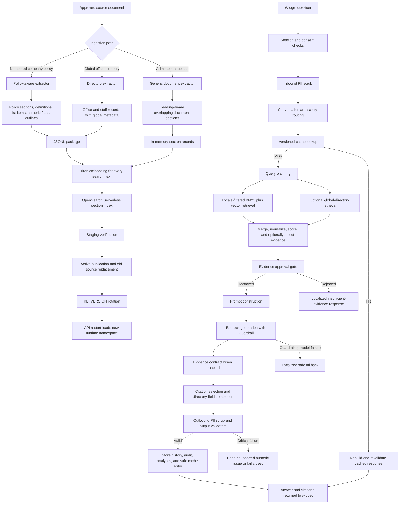

# AskVera Document Ingestion and Retrieval Reference

## Document control

| Item | Value |
|---|---|
| Purpose | Explain the complete current path from an approved source document to a cited AskVera answer |
| Repository | `askvera-deploy` |
| Code baseline reviewed | Git commit `b1be6af` |
| Primary production retrieval path | `RETRIEVAL_PROVIDER=opensearch_section` when set by runtime configuration |
| OpenSearch index default | `askvera-policy-sections` |
| Embedding model | Amazon Titan Text Embeddings V2 |
| Embedding dimension | 1,024 |
| Answer model | Amazon Bedrock Converse using the configured Claude inference profile |
| Configuration source | Source defaults plus environment and AWS Systems Manager Parameter Store overrides |

> Important: this document describes the code at the commit above. Values such
> as the active retrieval provider, model, feature flags, KB version, and
> endpoints can be overridden at runtime through SSM. Source-code defaults and
> deployed production values are not necessarily identical.

## 1. End-to-end overview



## 2. Source locations and ownership

| Responsibility | Current code |
|---|---|
| Policy PDF extraction | `scripts/ingestion/extract_policy_sections.py` |
| Global office-directory extraction | `scripts/ingestion/extract_global_office_directory.py` |
| OpenSearch loading and publication | `scripts/ingestion/load_policy_sections_to_opensearch.py` |
| Bedrock-style section package upload | `scripts/ingestion/upload_section_package.py` |
| Admin portal ingestion | `services/knowledge_ingestion.py` and `api/admin_routes.py` |
| Embedding generation | `services/embeddings.py` |
| Retrieval backend selection | `app/retrieval/service.py` |
| OpenSearch retrieval | `app/retrieval/opensearch_sections.py` |
| Shared section scoring | `app/retrieval/section_index.py` |
| Query planning and evidence selection | `app/retrieval/providers.py` |
| Evidence approval | `app/evidence.py` |
| Claim-level evidence contract | `app/evidence_contract.py` |
| Prompt construction | `app/prompts/builder.py` and `app/prompts/templates.py` |
| Bedrock answer generation | `app/models/bedrock_provider.py` |
| Chat orchestration | `app/orchestrator/chat_orchestrator.py` |
| Response and citation construction | `app/response/builder.py` |
| Directory field protection | `utils/directory_fields.py` |
| Output validation | `app/validation/` |
| PII handling | `services/pii.py` |
| Cache | `services/cache.py` |
| Session history and lifecycle | `services/session.py` and `services/session_service.py` |
| Consent | `services/consent_service.py` |
| Analytics and feedback | `services/analytics.py` and `services/feedback.py` |
| Audit delivery | `services/audit.py` and `app/audit/` |
| Runtime configuration | `config/settings.py` plus SSM |
| Market and language catalog | `config/markets.json` and `services/market_config.py` |
| Controlled localized conversation copy | `config/conversation_routes.json` |

## 3. The three ingestion paths

AskVera currently has three different ingestion paths. They serve different
document structures and must not be treated as interchangeable.

### 3.1 Policy-aware command-line ingestion

Use this for company policies with numbered sections. It preserves section
identity and creates smaller structured child chunks for definitions, lists,
and numeric rules.

```text
PDF
 -> page text extraction
 -> cleanup and contents-page detection
 -> numbered section detection
 -> oversized-section splitting
 -> structured child-chunk expansion
 -> JSONL/CSV
 -> staging index
 -> verification
 -> active replacement
```

This is the preferred path when accurate policy section citations, rank rules,
definitions, thresholds, and qualification conditions matter.

### 3.2 Global office-directory ingestion

Use this for the approved international office directory. The extractor creates
one record for each office and one record for each staff block.

All records are loaded with:

```json
{
  "country": "GLOBAL",
  "language": "en",
  "document_type": "office_directory",
  "access_scope": "global"
}
```

These records are intentionally available from every selected market. They are
retrieved separately from country policy content.

### 3.3 Admin portal general ingestion

The admin upload API accepts:

```text
.pdf .docx .txt .md .csv .html .htm
```

It supports these document types:

```text
policy
product_information
training
marketing
legal
faq
operations
other
```

The generic path is heading-aware but is not policy-section-aware. It creates
overlapping chunks up to 4,500 characters with a 450-character overlap.

**Current operational consequence:** uploading a numbered company policy
through the generic admin portal does not produce the same section, definition,
list-item, and numeric-fact structure as
`extract_policy_sections.py`. Until the portal invokes the specialized policy
extractor, use the policy-aware command-line path for production policy files.

## 4. Policy PDF extraction in detail

### 4.1 Input

Required command arguments:

```text
--pdf
--country
--language
--output-dir
```

Optional metadata:

```text
--document-version
--effective-date
--status active|inactive
--min-section-chars
--bedrock-dir
```

### 4.2 PDF reading

The extractor uses `pypdf.PdfReader` and `page.extract_text()`.

It does not currently:

- run OCR;
- classify scanned versus text PDFs automatically;
- interpret images;
- reconstruct complex visual tables with a table-recognition engine.

A scanned PDF with no embedded text can therefore produce no usable sections.

### 4.3 Page cleanup

The extractor:

1. removes null characters;
2. applies known mojibake repairs;
3. removes known repeated policy headers;
4. removes lines containing only a page number;
5. normalizes horizontal spaces while preserving line boundaries;
6. restores inline section boundaries when multiple numbered headings were
   flattened onto one line.

Line boundaries are important because list-item and compact numeric-fact
expansion depend on them.

### 4.4 Contents-page detection

A page is treated as a table of contents when it contains enough section-like
headings and either:

- at least three dotted or page-number-style entries; or
- a high ratio of short heading lines.

The current threshold expects at least six heading-like entries. This is
language-neutral and does not depend on English words such as "contents".

Contents pages are excluded from ordinary body-section parsing and can instead
produce `document_outline` chunks.

### 4.5 Numbered section detection

The parser recognizes section identifiers such as:

```text
1
1.01
4.01a
17.01
```

It performs extra checks to reject ordinary numbered prose. A candidate heading
must resemble a title rather than a long sentence or punctuation-heavy
paragraph.

For every accepted section, the parser records:

```text
source_file
country
language
section_id
title
start_page
end_page
content
document_version
effective_date
status
chunk_type
parent_section_id
metadata
```

### 4.6 Base chunks

The extractor creates these base chunk types:

| Chunk type | Purpose |
|---|---|
| `section` | A normal numbered policy section |
| `section_part` | A bounded part of an oversized section |
| `document_front_matter` | Searchable first-page title/version material |
| `document_outline` | Searchable policy outline derived from contents pages |

The front-matter chunk is limited to approximately 1,800 characters.

### 4.7 Oversized sections

A section larger than 8,000 characters is divided at line boundaries. Parts
receive identifiers such as:

```text
5.04-part-1
5.04-part-2
```

Each part keeps the original section in `parent_section_id`. Retrieval and
citations can therefore display the parent policy section rather than only the
technical part identifier.

### 4.8 Structured atomic child chunks

After base extraction, the parser keeps parent sections and adds smaller child
records.

#### Definition chunks

Definition-like entries such as `Term: definition` become:

```text
chunk_type = definition
section_id = <parent>-definition-<n>
parent_section_id = <parent>
```

#### List-item chunks

Items beginning with markers such as `(a)`, `(b)`, `a.`, or similar structures
become:

```text
chunk_type = list_item
parent_section_id = original section
```

#### Compact numeric facts

Short lines that contain both letters and digits can become:

```text
chunk_type = numeric_fact
```

The current detector accepts bounded lines approximately 12 to 360 characters
long and only expands a numeric group when at least two compact rows are
present. This avoids turning every isolated number into a separate chunk.

#### Context prefix

Atomic children include parent context:

```text
Section <section_id>: <section title>
<atomic child content>
```

This keeps small fragments meaningful when retrieved independently.

### 4.9 Identifier uniqueness

If a PDF repeats the same section identifier, later records receive a suffix:

```text
<section>-occurrence-2
<section>-occurrence-3
```

This prevents one logical record from silently replacing another in an
extraction package.

### 4.10 Extraction outputs

The extractor writes:

- `*.sections.jsonl` for indexing;
- `*.sections.csv` for human inspection;
- optional individual text files and metadata sidecars for a Bedrock section
  package;
- an optional package manifest.

Example JSONL record:

```json
{
  "source_file": "CA-EN-Company-Policy.pdf",
  "country": "CA",
  "language": "en",
  "section_id": "4.01a",
  "title": "Assistant Supervisor",
  "start_page": 10,
  "end_page": 10,
  "content": "Section 4.01a: Assistant Supervisor\n...",
  "document_version": "2026-05",
  "effective_date": "2026-05-01",
  "status": "active",
  "chunk_type": "list_item",
  "parent_section_id": "4.01",
  "metadata": {
    "country_code": "CA",
    "section_title": "Assistant Supervisor",
    "document_type": "policy",
    "access_scope": "country"
  }
}
```

## 5. Global directory extraction in detail

### 5.1 Record model

The directory extractor produces:

- office records;
- staff records.

Section IDs have deterministic readable forms:

```text
office-001-<slug>
staff-001-<slug>
```

The record includes:

```text
directory_section = office|staff
record_country = country named inside the directory
document_type = office_directory
access_scope = global
```

### 5.2 Field preservation

Directory content contains repeated labels such as:

```text
Country
Office
Address
Phone
Fax
Toll-free
Mailbox
Website
Contact
Title
Email
Cell
Territory
Region
Product Center
```

`utils/directory_fields.py` parses those label/value pairs and preserves the
approved value text.

During answer construction:

1. the model receives both raw content and a formatted approved-field block;
2. missing approved contact values can be restored;
3. restoration uses only the highest-ranked directory record;
4. secondary records cannot contribute values, preventing two countries or
   offices from being merged;
5. empty fields are omitted rather than rendered as empty labels.

### 5.3 Multilingual directory questions

The global directory is currently indexed in the configured global document
language, default `en`.

For a question in another language, AskVera sends a small Bedrock translation
request for search purposes only. The translation prompt preserves:

- proper names;
- countries;
- organization names;
- acronyms;
- numbers;
- email addresses;
- phone numbers.

If translation fails, retrieval falls back to the original question.

## 6. Admin portal ingestion in detail

### 6.1 API

The protected admin endpoint is:

```http
POST /api/admin/documents
```

Multipart form fields:

```text
file
country
language
document_type
access_scope
document_version
effective_date
```

The API validates:

- the country exists in the configured market catalog;
- the language is allowed for that country;
- the document type is supported;
- the access scope is `country` or `global`;
- the extension is supported;
- the file is non-empty;
- the file is within `ADMIN_UPLOAD_MAX_BYTES`, currently 25 MiB by default.

### 6.2 Job lifecycle

An RDS `ingestion_jobs` record is created and the API returns immediately. A
FastAPI background task moves through:

```text
queued -> extracting (15%) -> uploading (35%) -> indexing (55%) -> ready (100%)
```

An exception changes the job to `failed` and stores a bounded error message.

### 6.3 Generic extraction

| Type | Extraction behavior |
|---|---|
| PDF | `pypdf` page text |
| DOCX | Reads `word/document.xml` from the ZIP package |
| CSV | Joins each row with ` | ` |
| HTML | Removes tags and decodes entities |
| TXT/MD | UTF-8 text with replacement for invalid bytes |

### 6.4 Generic chunking

The generic chunker:

1. cleans whitespace;
2. identifies short uppercase or numbered headings;
3. divides text into heading blocks;
4. creates chunks up to 4,500 characters;
5. overlaps adjacent chunks by 450 characters;
6. assigns sequential IDs such as `doc-0001`;
7. records the source page when available.

### 6.5 Source and job persistence

The original file is uploaded to:

```text
s3://<KNOWLEDGE_UPLOAD_BUCKET>/<KNOWLEDGE_UPLOAD_PREFIX>/<job_id>/<filename>
```

RDS receives:

- an `ingestion_jobs` operational record;
- a `knowledge_documents` document record.

The temporary local file is removed after processing.

## 7. Embedding generation

`services/embeddings.py`:

1. normalizes all whitespace to single spaces;
2. limits embedding input to 8,000 characters;
3. invokes the configured Bedrock embedding model;
4. requires an `embedding` array in the response;
5. converts every element to `float`;
6. caches up to 2,048 embeddings in the API process with `lru_cache`.

The default embedding model is:

```text
amazon.titan-embed-text-v2:0
```

Embedding failures raise an application AWS service error; records are not
silently indexed without vectors.

## 8. OpenSearch index document

### 8.1 Search text

The value embedded and indexed as `search_text` concatenates:

```text
source_file
country
language
section_id
title
content
```

### 8.2 Logical ID

The source document contains this stable logical ID:

```text
<country>|<language>|<source_file>|<section_id>
```

The loader intentionally does not send that value as OpenSearch `_id`.
OpenSearch Serverless rejected client-provided document IDs for the active
create/index operation used by this collection. OpenSearch generates `_id`,
while the logical ID remains in `_source.id` for merging.

### 8.3 Mapping

| Field | Mapping |
|---|---|
| `id` | keyword |
| `status` | keyword |
| `source_file` | keyword |
| `source_uri` | keyword |
| `country` | keyword |
| `language` | keyword |
| `document_type` | keyword |
| `access_scope` | keyword |
| `section_id` | keyword |
| `section_title` | text plus keyword subfield |
| `document_version` | keyword |
| `effective_date` | date, malformed values ignored |
| `chunk_type` | keyword |
| `parent_section_id` | keyword |
| `start_page` | integer |
| `end_page` | integer |
| `content` | text |
| `search_text` | text |
| `content_hash` | SHA-256 keyword |
| `ingestion_id` | keyword |
| `metadata` | enabled object |
| `embedding` | 1,024-dimensional k-NN vector |

Vector method:

```text
HNSW
cosine similarity
FAISS engine
```

## 9. Staging, publication, and replacement

### 9.1 Staging

Load a new source with:

```text
status = staging
```

Staging records cannot be retrieved by the chat path because every query
filters to `status=active`.

Verify before publication:

- expected chunk count;
- one source file;
- expected country and language;
- expected access scope and document type;
- representative first, middle, and last records;
- no duplicate active source;
- readable extracted text;
- correct page ranges;
- required directory fields when applicable.

### 9.2 Active replacement

`--replace-source` is allowed only with `--status active`.

The loader:

1. requires exactly one non-empty country, language, and source file in the
   JSONL;
2. creates a new random `ingestion_id`;
3. indexes every new record;
4. stops if indexing reports errors;
5. searches for older active or staging records with the same country,
   language, and source file;
6. deletes records whose `ingestion_id` differs from the new run.

This protects unrelated locales and documents. It does not perform a
collection-wide delete.

### 9.3 KB version and cache invalidation

After successful active replacement, `--publish-kb-version` can update the SSM
`KB_VERSION` parameter. `auto` creates a timestamped value containing the first
eight characters of the ingestion run.

AskVera includes `KB_VERSION` in every cache key. Changing it creates a new
logical cache namespace without requiring a destructive Valkey flush.

The API must be restarted after publication so it loads the new SSM value.

### 9.4 OpenSearch Serverless behavior

The current collection does not support or authorize every classic OpenSearch
index operation used during development:

- manual `_refresh` has returned 404;
- index deletion can return 403 when the application role lacks permission;
- new records can take a short time to become consistently visible.

Production publication should therefore avoid `--recreate-index`, use
source-level replacement, and allow for eventual consistency during
verification.

## 10. Country, language, and global isolation

### 10.1 Country policy filter

Country-scoped retrieval requires:

```text
country in configured document-country aliases for the selected market
language = selected primary language tag
status = active
```

The market catalog can map one displayed market to more than one accepted
document country code, for example an alias migration such as `GB` and `UK`.

### 10.2 Language behavior

Language tags are reduced to their primary value:

```text
en-US -> en
fr-CA -> fr
```

English fallback is disabled by default. If
`OPENSEARCH_ALLOW_ENGLISH_FALLBACK=true`, non-English policy retrieval may also
use English documents. This is an explicit operational decision, not an
automatic behavior.

### 10.3 Global behavior

Global records require:

```text
access_scope = global
status = active
```

Global records are not constrained to the selected market. The query planner
must decide that the question actually needs global material before the
directory search is run.

### 10.4 Isolation examples

| User selection and question | Eligible evidence |
|---|---|
| Canada / French policy question | Active CA aliases in French |
| United States / Spanish policy question | Active US aliases in Spanish |
| Germany / German policy question | Active DE aliases in German |
| Canada / French asking for Mexico office | Global directory records, searched in the global document language |
| Belgium user asking for exact US policy figures | Belgium policy only unless the source is explicitly global; US country policy is not eligible |

## 11. Runtime retrieval pipeline

### 11.1 Provider selection

`RetrievalService` selects:

| Setting | Provider |
|---|---|
| `section` | PostgreSQL section provider |
| `opensearch_section` | OpenSearch section provider |
| anything else, including source default `bedrock` | Bedrock managed-KB provider |

The service can switch providers after refreshed runtime settings are loaded.
The production OpenSearch path therefore depends on the deployed SSM value,
not only the source default.

### 11.2 Query planning

The multilingual Bedrock query planner can return up to the configured query
count, default four. It determines:

- normalized retrieval queries;
- whether global directory material is relevant;
- whether a document outline is useful;
- conversation intent and subtype;
- intent confidence;
- explicit support-request action.

The planner is instructed not to invent facts, numbers, percentages, section
IDs, or country-specific business rules.

Secondary planned queries receive a score weight of `0.88`; the original query
receives `1.0`.

### 11.3 Conversation routes

Some requests do not need policy retrieval:

- exact configured greetings/capability/thanks messages;
- high-confidence assistant-meta intent;
- medical-claim safety response;
- income-claim safety response;
- off-topic response;
- verified explicit support request, which returns `open_support_form`.

Exact zero-token assistant messages are managed in
`config/conversation_routes.json`. Substantive business questions continue to
document retrieval and fail closed when evidence is insufficient.

### 11.4 BM25 country-policy query

Every locale text query retrieves up to the configured candidate count,
currently 30 by default, from active eligible records.

Field boosts:

```text
section_id       ^8
section_title    ^6
content          ^3
search_text      ^1
```

Additional boosts:

```text
section_title exact phrase  +5
content exact phrase        +2
```

The multi-match query uses:

```text
type = best_fields
operator = or
fuzziness = AUTO
```

Automatic fuzziness helps with ordinary misspellings without hardcoding test
questions.

### 11.5 Directory BM25 query

Directory field boosts:

```text
metadata.record_country ^12
section_title            ^10
content                   ^4
search_text               ^2
```

Additional phrase boosts:

```text
record_country +18
section_title   +8
```

The query is restricted to active `office_directory` records with global
access.

### 11.6 Vector query

The user or planned query is embedded with Titan. OpenSearch runs filtered k-NN
retrieval with:

```text
k = OPENSEARCH_CANDIDATE_COUNT
size = OPENSEARCH_CANDIDATE_COUNT
```

The metadata filter is applied inside the vector query, so a high semantic
similarity cannot bypass market, language, status, or access-scope rules.

### 11.7 Outline query

When the planner prefers an outline, AskVera runs an additional BM25 query
restricted to:

```text
chunk_type = document_outline
```

An outline candidate receives a `+2.0` scoring bonus in that situation.

### 11.8 Hit merging

Text and vector hits are merged by the stable logical source `id`.

- Duplicate text hits keep the strongest text rank.
- Vector rank is multiplied by `OPENSEARCH_VECTOR_WEIGHT`, default `0.25`.
- If a text hit already exists, the weighted vector rank is added.
- If only a vector hit exists, it is retained.

### 11.9 OpenSearch rank normalization

Raw BM25 scores can be much larger than the generic section scorer expects.
AskVera applies logarithmic normalization:

```text
normalized_rank =
  log(1 + raw_score) / log(1 + maximum_raw_score) * 1.25
```

This stops common policy words with very high BM25 values from overwhelming
title, section, and topic alignment.

### 11.10 Shared source scoring

The normalized search rank is adjusted using language-neutral,
document-derived signals:

- exact section ID in the question: `+0.75`;
- exact normalized title in the question: `+0.8`;
- strong character n-gram title overlap: up to roughly `+1.1`;
- question-token coverage in the first part of search text: up to `+0.35`;
- exact named-topic/title matches: up to approximately `+1.6`;
- short key-phrase matches in title or content;
- alphanumeric identifiers, such as a section-like or named program token.

For directory records, the country named in the question receives:

```text
exact normalized country match  +2.4
country acronym match            +2.2
strong character-overlap match   +1.6
```

These are generic matching rules based on document content and metadata. They
are not hardcoded answers or policy thresholds.

### 11.11 Optional evidence selector

If `OPENSEARCH_EVIDENCE_SELECTOR_ENABLED=true`, a focused Bedrock call selects
the best candidate ranks. It does not answer the question.

Candidate input includes:

- document type;
- access scope;
- directory record type;
- record country;
- section ID;
- section title;
- current score;
- up to 1,200 characters of text.

The selector:

- tolerates spelling, accent, and accidental character-spacing errors;
- compares meaning across languages;
- prefers a matching directory record for office/contact questions;
- avoids replacing a direct global office record with a generic policy mention;
- returns JSON selected ranks;
- falls back to the original ranked rows if it fails or selects nothing.

The candidate list reserves space for global records when a global query was
run, preventing all global evidence from being crowded out by policy records.

### 11.12 Final retrieval result

Only rows at or above `SECTION_RETRIEVAL_MIN_SCORE`, default `0.05`, are
eligible. AskVera returns up to `OPENSEARCH_RESULT_COUNT`, default five.

The result includes:

- normalized `RetrievedDocument` objects;
- API-compatible source dictionaries;
- conservative confidence;
- candidate count;
- query count;
- whether global content was searched;
- whether outline evidence was preferred;
- whether a global search query was translated;
- up to 30 candidate sources for diagnostics.

### 11.13 Non-primary retrieval providers retained in the code

The repository retains two alternatives behind `RETRIEVAL_PROVIDER`.

#### PostgreSQL section provider

`RETRIEVAL_PROVIDER=section` searches the `policy_sections` table. It uses:

- Unicode-normalized tokens;
- PostgreSQL full-text queries;
- a broad regular-expression candidate fallback;
- stored embeddings and cosine similarity;
- the shared source-scoring and confidence functions.

This provider is useful for comparison and evaluation but is not the stated
production OpenSearch path.

#### Bedrock managed Knowledge Base provider

The default source setting `RETRIEVAL_PROVIDER=bedrock` uses the configured
Bedrock Knowledge Base ID and data source. It:

- applies country/language metadata filters;
- supports vector or hybrid managed retrieval configuration;
- collects more candidates than final results;
- merges duplicate managed-KB results;
- performs generic relevance reranking;
- can use the optional evidence selector.

The old managed Knowledge Bases in the AWS console are not automatically used
when runtime SSM selects `opensearch_section`. Provider selection is exclusive
for a request.

## 12. Evidence approval

Retrieval does not automatically authorize generation.

For substantive questions, `approve_evidence()` requires:

1. at least one returned document;
2. at least one eligible current-locale country document or a global document;
3. sufficient retrieval confidence or a top section score above the configured
   minimum.

Lexical topic overlap is retained for diagnostics but is not the safety gate.

If approved, the complete bounded retrieval set is retained for generation.
This avoids dropping a governing section that ranked fourth or fifth.

If rejected, AskVera returns a localized insufficient-evidence response and
does not ask the answer model to guess.

## 13. Prompt construction and generation

### 13.1 Model context

Each retrieved source is rendered with:

```text
source number and title
stable source ID
policy or parent section
page
URI
country
language
approved structured directory fields, when present
full bounded content
```

### 13.2 Session history

Recent session history is included only for conversational continuity. The
system prompt explicitly states that history is not evidence. Factual claims
still require retrieved approved chunks.

The default maximum history is ten stored message strings, approximately five
user/assistant turns.

### 13.3 Answer rules

The system prompt requires:

- the selected user language;
- an exact answer first;
- concise natural wording;
- facts only from retrieved authorized chunks;
- exact grounding of numbers, dates, ranks, discounts, bonuses, and thresholds;
- no transfer of facts between countries, ranks, sections, products, or tiers;
- complete qualification rules, including alternatives, exceptions, and
  mandatory conditions;
- no medical, treatment, or guaranteed-income claims;
- exact directory values without mixed countries or empty labels.

### 13.4 Bedrock request

Generation uses Bedrock Runtime `converse` with:

- system prompt;
- one user prompt;
- configured maximum output tokens, default 1,024;
- configured Bedrock Guardrail identifier and version.

### 13.5 Model resilience

The model provider supports:

- a primary model;
- an optional fallback model;
- transient-error detection;
- a process-local circuit breaker;
- default failure threshold of three;
- default reset window of 60 seconds.

The fallback model is attempted for throttling, service errors, timeouts, and
other configured transient Bedrock failures.

### 13.6 Confidence check

The model call is blocked when:

- there are no sources; or
- confidence is below the configured threshold and neither strong local
  relevance nor adequate multi-source evidence exists.

Low confidence can be allowed when the evidence summary still satisfies the
configured source-count and top-score requirements.

## 14. Optional evidence contract

When `EVIDENCE_GATED_OUTPUT_ENABLED=true`, the model must return JSON containing:

```json
{
  "status": "approved",
  "answer": "User-facing answer",
  "evidence_ids": ["exact source IDs"],
  "claims": [
    {
      "text": "One factual claim",
      "evidence_ids": ["supporting source ID"]
    }
  ],
  "coverage": {
    "complete": true,
    "omitted_material_facts": []
  }
}
```

The parser rejects:

- malformed JSON;
- a status other than `approved`;
- evidence IDs not present in retrieved context;
- factual claims without supporting IDs;
- incomplete coverage;
- non-empty omitted-material-fact lists.

Accepted evidence IDs narrow the source set and become the citation source of
truth. Rejected contracts return a safe insufficient-evidence response.

This feature is disabled by the source default and must be intentionally
enabled in runtime configuration.

## 15. Response construction and citations

### 15.1 Canonical response

The internal response contains:

```text
answer
citations
suggestions
cards
confidence
metadata
correlation_id
```

### 15.2 Citations with an evidence contract

When a contract is accepted, AskVera cites up to three documents named by the
contract. It does not run a second language-dependent lexical filter.

### 15.3 Citations without an evidence contract

AskVera ranks retrieved documents against the final answer using:

- Unicode token overlap;
- numeric overlap;
- named phrase overlap;
- original retrieval score.

Answers containing numbers require stronger citation support and at least one
matching number. Numeric answers normally show the best supporting citation;
non-numeric answers can show up to two.

The displayed excerpt is selected to focus on the part most relevant to the
answer.

### 15.4 Guardrail responses

When Bedrock reports `guardrail_intervened`, retrieved policy documents are not
shown as citations. Safety copy is not falsely presented as a policy-grounded
answer.

## 16. PII and directory contact safety

### 16.1 Inbound processing

The raw user message is scrubbed before retrieval or generation.

Amazon Comprehend PII detection is used for supported languages (`en` and
`es`). Language-neutral pattern detection supplements it and covers:

- government ID-like values;
- payment-card-like values;
- email addresses;
- phone numbers.

Location names can be preserved for directory queries.

### 16.2 Sensitive input

High-risk placeholders such as government ID, SSN, or payment-card data cause
an immediate localized privacy response.

AskVera then skips:

- retrieval;
- generation;
- cache writes for a policy answer.

The sensitive original value is not repeated in the response.

### 16.3 Outbound processing

Before an answer leaves the orchestrator:

1. exact missing directory contact fields can be restored from the primary
   retrieved record;
2. PII scrubbing runs again;
3. approved public terms and exact retrieved document content are allowlisted;
4. unresolved PII placeholders are removed.

This allows approved public office contact details while still blocking
unapproved personal data.

## 17. Output validation and failure paths

Default validators run in this order:

1. answer;
2. confidence;
3. citations;
4. language;
5. metadata;
6. length;
7. numeric grounding.

Issues have:

```text
PASS
WARNING
ERROR
CRITICAL
```

Errors and critical findings make the result invalid.

### 17.1 Numeric grounding

Numeric claims are checked against retrieved evidence. Directory fields allow
formatting variants such as punctuation or spaces in a phone number, but the
digits must still come from the approved record.

If the only critical issue is `NUMERIC_CLAIM_UNGROUNDED`, AskVera:

1. removes unsupported numeric sentences;
2. validates the repaired answer again;
3. returns it only if no critical issue remains.

Otherwise, a critical validation issue returns the localized
insufficient-evidence response.

### 17.2 Failure-layer metadata

Important diagnostic values include:

```text
retrieval_miss
low_confidence
evidence_gate
evidence_contract
aws_guardrail
numeric_validator
citation_validator
output_validator
sensitive_pii_input
```

These values support admin diagnostics without exposing private prompt content.

## 18. Cache behavior

### 18.1 Backend

AskVera uses Redis-compatible Amazon ElastiCache/Valkey over TLS with IAM
authentication when configured.

### 18.2 Cache key

The SHA-256 cache key includes:

```text
retrieval query
country
language
role
CACHE_SCHEMA_VERSION
KB_VERSION
RETRIEVAL_PIPELINE_VERSION
CONVERSATION_ROUTING_VERSION
RESPONSE_PIPELINE_VERSION
PROMPT_VERSION
BEDROCK_GUARDRAIL_VERSION
primary model ARN
fallback model ARN
```

Changing knowledge, retrieval, routing, response, prompt, guardrail, or model
versions logically invalidates earlier entries.

Default TTL:

```text
7,200 seconds
```

### 18.3 Cache-hit safety

A cache hit is rebuilt as a canonical response and revalidated. It is not
blindly returned.

Cached token usage is reported as tokens saved, while the cache-hit request
itself reports zero input and output model tokens.

### 18.4 Cache-write restrictions

AskVera does not cache:

- fallbacks;
- responses with a failure layer;
- guardrail responses;
- client actions such as opening support;
- responses with critical validation.

## 19. Session, consent, and history

### 19.1 Session lifecycle

Before chat:

1. the session must exist;
2. it must not be ended;
3. idle expiry must not have passed;
4. maximum lifetime must not have passed;
5. activity and sliding expiry are updated.

Current defaults:

```text
idle timeout: 30 minutes
maximum lifetime: 7 days
transcript retention after expiry: 90 days
history passed to the model: 10 message strings
```

### 19.2 Consent

Consent is written to:

- `consent_log`;
- the matching `chat_sessions` record.

The session must have accepted the current `LEGAL_VERSION`. A legal-version
change invalidates old consent for chat purposes.

### 19.3 Session history

The default backend is PostgreSQL. Each stored turn contains:

```text
user: <scrubbed message>
vera: <final answer>
```

Only the most recent configured number of messages is retained in the compact
history array. A memory backend exists for tests and local demos.

Ending a chat marks it ended and expires it; it does not immediately delete
the transcript or consent audit.

## 20. Operational data stores

| Data | Store | Notes |
|---|---|---|
| Approved original source files | Amazon S3 | Country/language or global approved prefixes |
| Search chunks and vectors | OpenSearch Serverless | Active and staging records share the index |
| Chat sessions and compact transcripts | Amazon RDS PostgreSQL | Sliding expiration and retention |
| Consent evidence | Amazon RDS PostgreSQL | Versioned legal acceptance |
| Interaction analytics | Amazon RDS PostgreSQL | Questions, model usage, locale, traffic source, diagnostics |
| Feedback | RDS plus optional Amazon SQS | Supports admin analysis and review workflows |
| Support delivery audit | RDS | Does not retain support contact details or support text in the analytics record |
| Ingestion jobs and document registry | RDS | Admin portal progress and history |
| Answer cache | Amazon ElastiCache/Valkey | Versioned locale-aware response cache |
| Runtime secrets | AWS Secrets Manager | Loaded through application AWS clients |
| Runtime non-secret settings | AWS Systems Manager Parameter Store | `/askverachat/prod/` namespace |
| Audit stream | Optional Amazon Data Firehose | Batched asynchronous audit events |
| Metrics, logs, and alarms | Amazon CloudWatch | Pipeline stages and operational health |

## 21. Observability

Each request receives a correlation ID.

Pipeline metrics cover stages such as:

```text
cache lookup
retrieval
prompt construction
model generation
response construction
validation
audit delivery
```

Useful metadata includes:

- country and language;
- retrieval provider;
- source count;
- confidence;
- candidate count;
- cache hit and tokens saved;
- model and fallback usage;
- input and output tokens;
- latency;
- finish reason;
- validation summary;
- failure layer.

The admin portal provides overview, interaction, recent trace, trace detail,
and ingestion endpoints. Recent detailed traces are process-local and can
disappear after an API restart.

## 22. Recommended production policy ingestion runbook

### Step 1: upload the approved original

Use a country/language prefix:

```text
s3://<approved-bucket>/approved/<Market>_<language>/policies/<file>.pdf
```

Use a global prefix only for documents approved for every market:

```text
s3://<approved-bucket>/approved/Global_en/<type>/<file>.pdf
```

### Step 2: extract

```bash
python -B scripts/ingestion/extract_policy_sections.py \
  --pdf /tmp/XX-LL-Company-Policy.pdf \
  --country XX \
  --language ll \
  --document-version YYYY-MM \
  --effective-date YYYY-MM-DD \
  --output-dir /tmp/askvera-policy-sections/XX/ll
```

### Step 3: inspect

Check:

- section count is plausible;
- first and last policy pages are covered;
- largest chunk is bounded;
- text is readable;
- accented/non-Latin characters are intact;
- key definition, numeric, list, and late-document sections exist;
- source file, country, and language are correct.

### Step 4: stage

```bash
python -B scripts/ingestion/load_policy_sections_to_opensearch.py \
  --jsonl /tmp/askvera-policy-sections/XX/ll/XX-LL-Company-Policy.sections.jsonl \
  --source-uri-prefix s3://<approved-bucket>/approved/<Market>_<ll>/policies \
  --status staging \
  --document-type policy \
  --access-scope country
```

### Step 5: verify staging

Verify count and sample metadata with OpenSearch queries filtered by:

```text
country
language
source_file
status=staging
document_type
access_scope
```

Do not publish when counts, metadata, text, or page coverage are wrong.

### Step 6: publish and replace

```bash
python -B scripts/ingestion/load_policy_sections_to_opensearch.py \
  --jsonl /tmp/askvera-policy-sections/XX/ll/XX-LL-Company-Policy.sections.jsonl \
  --source-uri-prefix s3://<approved-bucket>/approved/<Market>_<ll>/policies \
  --status active \
  --document-type policy \
  --access-scope country \
  --replace-source \
  --publish-kb-version auto
```

### Step 7: restart and verify

Restart the API so it reloads SSM, then verify:

```text
new source active count = expected
same source staging count = 0
only one active ingestion run
other countries and languages unchanged
runtime RETRIEVAL_PROVIDER = opensearch_section
runtime KB_VERSION = newly published value
health endpoint = healthy
```

### Step 8: smoke and regression tests

Test at least:

- direct definitions;
- qualification requirements;
- numeric thresholds;
- typo variants;
- spaced-character variants;
- same concept in every uploaded language;
- wrong-market isolation;
- global directory from multiple selected markets;
- medical and income claim safety;
- sensitive PII;
- unsupported/off-topic;
- citation source, page, and country;
- cache miss followed by safe cache hit.

## 23. Global directory runbook difference

Extract with the directory script, verify office and staff counts, then stage
and publish with:

```text
--document-type office_directory
--access-scope global
```

Do not publish a directory package when:

- the expected office/staff totals differ;
- `record_country` is missing;
- email wrapping is corrupted;
- an office block contains fields from the next country;
- the source is labeled country-scoped;
- global retrieval returns selected-market policy above the exact requested
  office record.

## 24. Testing and evaluation

The repository includes:

- unit tests for extraction and chunking;
- unit tests for OpenSearch locale/global filtering;
- retrieval evaluation scripts;
- response and validator tests;
- widget build validation;
- CI compilation, lint, test, and configuration checks.

Retrieval-only evaluation should be separated from answer-quality evaluation:

| Layer | Question answered |
|---|---|
| Extraction | Was the fact converted into a valid chunk? |
| Indexing | Is the chunk active with correct metadata and embedding? |
| Candidate retrieval | Did the expected chunk appear in the candidate set? |
| Selection/ranking | Was the correct chunk selected into model context? |
| Evidence gate | Was generation correctly allowed or blocked? |
| Generation | Did the answer use the evidence completely and accurately? |
| Validation | Were unsupported claims removed or blocked? |
| Presentation | Were Markdown, references, and directory fields rendered correctly? |

This separation prevents an answer-format issue from being incorrectly
diagnosed as a retrieval failure.

## 25. What is and is not hardcoded

### Content-managed or configuration-driven

- markets and their supported languages;
- market-to-document-country aliases;
- localized greeting and fallback copy;
- runtime retrieval provider;
- index and endpoint;
- model and guardrail versions;
- KB, prompt, retrieval, routing, and response versions;
- global document language;
- evidence selector and evidence-contract feature flags;
- source document content and metadata;
- directory country and contact values.

The repository still contains `OPENSEARCH_GLOSSARY_*` settings and a
`search_glossary.json` file. The current OpenSearch provider does not read
those settings or that file. Current query expansion comes from the multilingual
query planner. Treat the glossary settings as inactive compatibility remnants,
not as part of the live retrieval path.

### Generic code rules

- numbered section recognition;
- definition/list/numeric-fact extraction;
- chunk-size limits;
- BM25 field boosts;
- vector weight;
- character and token overlap;
- active/staging replacement;
- locale/global access enforcement;
- PII categories;
- validator severities;
- cache safety.

### Not intended to be hardcoded

The ingestion and retrieval code must not contain:

- test question answers;
- expected policy figures;
- section numbers added only to pass one test;
- country-specific policy thresholds;
- per-language copies of business rules;
- office addresses, phone numbers, or emails copied into source code.

Those facts belong in approved documents and structured metadata.

## 26. Current limitations and engineering cautions

1. **No OCR:** scanned PDFs require OCR before ingestion.
2. **Generic admin policy parsing:** the portal path does not yet use the
   specialized policy extractor.
3. **Visual tables:** `pypdf` text order may not preserve a complex visual
   table correctly.
4. **Global directory language:** global search translation adds a Bedrock call
   for non-English questions.
5. **Eventual consistency:** OpenSearch Serverless count and search visibility
   can briefly disagree after bulk indexing/deletion.
6. **No refresh assumption:** do not depend on a manual `_refresh` endpoint.
7. **Source replacement scope:** replacement identity is country, language,
   and source filename. Renaming a source can leave the old filename active
   unless explicitly reviewed and removed.
8. **In-process embedding cache:** the 2,048-item cache is per API process, not
   shared across instances.
9. **In-process circuit breaker:** model circuit state is per API process.
10. **In-process detailed traces:** recent trace details are lost on restart.
11. **Runtime drift:** always verify SSM values after deployment; source defaults
    alone do not prove production behavior.
12. **Feature flags:** the evidence selector and evidence contract are disabled
    by source default and require deliberate rollout and regression testing.
13. **Admin background tasks:** FastAPI in-process background ingestion is
    appropriate for the current deployment but is not a durable distributed job
    queue. An API restart can interrupt a running upload.
14. **Publication rollback:** the loader adds the new run and then deletes the
    previous one. Operations should retain the approved source and extracted
    JSONL so the prior version can be republished if required.
15. **Inactive glossary configuration:** glossary settings and content remain
    in the repository, but the current OpenSearch provider does not consume
    them.

## 27. Runtime configuration checklist

Verify these values in the deployed service before a production test:

```text
APP_ENV
AWS_REGION
RETRIEVAL_PROVIDER
OPENSEARCH_ENDPOINT
OPENSEARCH_INDEX
OPENSEARCH_SERVICE
OPENSEARCH_RESULT_COUNT
OPENSEARCH_CANDIDATE_COUNT
OPENSEARCH_VECTOR_WEIGHT
OPENSEARCH_ALLOW_ENGLISH_FALLBACK
OPENSEARCH_GLOBAL_DOCUMENT_LANGUAGE
OPENSEARCH_EVIDENCE_SELECTOR_ENABLED
BEDROCK_EMBED_MODEL_ID
BEDROCK_MODEL_ARN
BEDROCK_FALLBACK_MODEL_ARN
BEDROCK_GUARDRAIL_ID
BEDROCK_GUARDRAIL_VERSION
BEDROCK_MIN_CONFIDENCE
BEDROCK_QUERY_PLANNER_ENABLED
EVIDENCE_GATED_OUTPUT_ENABLED
KB_VERSION
PROMPT_VERSION
RETRIEVAL_PIPELINE_VERSION
CONVERSATION_ROUTING_VERSION
RESPONSE_PIPELINE_VERSION
CACHE_SCHEMA_VERSION
CACHE_TTL_SECONDS
SESSION_IDLE_TIMEOUT_MINUTES
MAX_SESSION_DAYS
CHAT_HISTORY_MAX_MESSAGES
CHAT_TRANSCRIPT_RETENTION_DAYS
KNOWLEDGE_UPLOAD_BUCKET
KNOWLEDGE_UPLOAD_PREFIX
AUDIT_FIREHOSE_ENABLED
FEEDBACK_EXPECTED_ANSWER_ENABLED
ADMIN_RBAC_ENABLED
ADMIN_USER_MANAGEMENT_ENABLED
WIDGET_CONFIG_ADMIN_ENABLED
WIDGET_CONFIG_RUNTIME_ENABLED
WIDGET_LOADER_URL
WIDGET_STYLES_URL
```

## 28. Compact request sequence

```text
1. Widget initializes and receives a scoped token.
2. User selects market and language.
3. Widget loads legal documents for that locale.
4. Consent is recorded against the current legal version.
5. Chat request includes message, locale, role, and session ID.
6. API confirms token/session ownership.
7. Session is validated and touched.
8. Consent is checked.
9. Input PII is scrubbed.
10. Sensitive PII and exact conversational routes can return early.
11. Recent scrubbed history is loaded.
12. Follow-up context can be added to the retrieval query.
13. Governance evaluates the request.
14. Versioned cache is checked.
15. On a miss, the query planner builds search variants and scopes.
16. OpenSearch runs locale BM25 and filtered vector search.
17. Global directory search runs only when planned.
18. Hits are merged, normalized, scored, and optionally selected.
19. The evidence gate confirms eligible approved evidence.
20. Prompt builder inserts evidence and bounded history.
21. Bedrock generates through the configured Guardrail.
22. The optional evidence contract is parsed.
23. The response builder selects supporting citations.
24. Missing exact directory contacts can be restored from the primary record.
25. Output PII is scrubbed.
26. Validators inspect answer, confidence, citations, language, metadata,
    length, and numbers.
27. Critical numeric issues can be repaired once; other critical failures
    fail closed.
28. Output governance runs.
29. The scrubbed user turn and final answer are stored in session history.
30. Audit and analytics are recorded.
31. Only a complete safe answer is cached.
32. The API returns answer, sources, confidence, correlation ID, and metadata.
```

## 29. Optional operations extensions

These extensions support quality review and administration. They do not change
document extraction, chunking, embeddings, retrieval ranking, evidence
selection, prompts, or answer validation.

### 29.1 Expected answer feedback

When `FEEDBACK_EXPECTED_ANSWER_ENABLED=true`, a user who marks an answer as not
helpful can optionally describe what they expected. The field is limited to
2,000 characters, scrubbed by the existing PII service, and stored in
`feedback_events.expected_answer`. The companion
`expected_answer_present` field supports privacy-safe reporting without
requiring the text. Helpful votes never store this field.

### 29.2 Administrator RBAC

When `ADMIN_RBAC_ENABLED=true`, the Cognito access token remains the source of
authenticated identity while PostgreSQL stores application authorization:

- `admin_users`: Cognito subject, email, role, lifecycle status, and last login;
- `admin_user_scopes`: market, portal section, and permission grants;
- `admin_audit_log`: administrator lifecycle and configuration actions.

The API enforces every permission and market scope. The portal only renders
allowed navigation and actions. `ADMIN_USER_MANAGEMENT_ENABLED` separately
controls whether the Users management workflow is available.

### 29.3 Managed widget instances

When `WIDGET_CONFIG_ADMIN_ENABLED=true`, authorized administrators can manage
widget records in `widget_configs`. Records contain exact allowed origins,
allowed markets and languages, display settings, defaults, usage controls, a
public key, and status. Secrets are not returned in embed snippets.

`WIDGET_CONFIG_RUNTIME_ENABLED` is a separate runtime switch. While it is
false, initialization uses the existing static registry without modification.
When enabled, the RDS provider supplies widget registrations and the existing
dynamic CORS middleware enforces exact origin membership. Market and language
checks are repeated by the API. Rotating the public key makes the old key
unresolvable; disabling a record blocks new initialization.

### 29.4 Rollout safety

All four feature switches default to `false`. The three database migrations are
additive and idempotent. Enable expected-answer feedback first, then RBAC user
management, then widget administration, and finally the RDS widget runtime.
Use a non-production widget record and approved origin for the final runtime
test. Rollback is performed by disabling the relevant flag; existing UAT
retrieval and answer behavior remains untouched.
