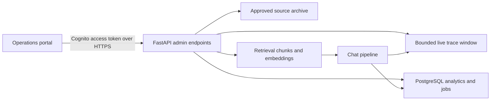

# AskVera Operations Portal

## Purpose

This package gives stakeholders one simple interface for understanding how AskVera works and gives administrators practical tools to improve it. It is country-independent: market and language metadata come from the existing market configuration instead of country-specific code paths.

## System flow

The live flow uses the actual metrics emitted by request received, governance, retrieval, prompt build, model generation, validation, response build, and response delivered. It exposes timings, result counts, confidence, and failure signals without exposing prompts, retrieved passages, secrets, or full session history. Common email and phone patterns are redacted from trace previews and stored analytics questions.

## Admin API

All routes require a Cognito access token from a member of the configured administrator group and return the normal AskVera success envelope. A separately managed API key can be enabled for local development or controlled break-glass access, but it is disabled in the production website configuration.

| Route | Purpose |
| --- | --- |
| `GET /api/admin/config` | Markets, languages, document types, scopes, and upload limit |
| `GET /api/admin/traces` | Recent live pipeline traces |
| `GET /api/admin/traces/{id}` | One trace with ordered stages |
| `GET /api/admin/analytics/overview` | Aggregate metrics and trend data |
| `GET /api/admin/analytics/interactions` | Answer-level quality review |
| `GET /api/admin/ingestions` | Recent document jobs and status |
| `POST /api/admin/documents` | Validate and queue an approved document |

Analytics are captured from the existing chat and feedback routes. The question text is locally redacted for common email and phone patterns, answers have already passed output PII controls, and session IDs are used only for distinct-user aggregation. Apply the organization's retention policy to `chat_analytics` and `feedback_events` before production launch.

## Knowledge ingestion

1. Validate extension, size, country, language, type, and scope.
2. Save a short-lived local working copy and create a durable job record.
3. Extract readable text from PDF, DOCX, text, Markdown, CSV, or HTML.
4. Split by generic headings and then into overlapping 4,500-character chunks.
5. Archive the approved original in S3 when a bucket is configured.
6. Generate embeddings and bulk-index the chunks in OpenSearch.
7. Only after the new load succeeds, remove older active chunks for the same market, language, and filename.

Country-scoped documents follow the chatbot's locale filter. Global documents are available to every country but still obey the requested language (including the configured English fallback). Failed extraction or indexing remains visible in the job list and never replaces an older working source.

## Production checklist

- Use Cognito authorization-code flow with PKCE and restrict access to `AskVeraAdmins`.
- Keep `ADMIN_AUTH_ALLOW_API_KEY=false` in normal production operation.
- Set `KNOWLEDGE_UPLOAD_BUCKET` to a private, encrypted, versioned S3 bucket with lifecycle and least-privilege IAM policies.
- Add the operations portal HTTPS origin to `ALLOWED_ORIGINS`; do not use a wildcard.
- Federate the Cognito user pool with company SSO when the identity team is ready; the built-in user pool supports the initial controlled launch.
- Configure CloudFront security headers and no-store caching for the portal shell.
- Confirm PostgreSQL backups and define retention for analytics, feedback, ingestion jobs, and document records.
- Add OCR (for example an asynchronous Textract worker) before accepting image-only scanned PDFs.
- For multiple API workers, move the short live-trace window to shared Redis or an event stream so every portal poll sees the same active request.
- Run unit tests, build the portal, perform a real upload in a non-production index, and verify a chat retrieves the new content before production deployment.

## Deployment boundary

The portal is packaged for production deployment in `deployment/admin-portal.yaml`. The stack creates private S3 hosting, CloudFront, security headers, Cognito and the administrator group. DNS, the ACM certificate, initial administrator membership, API SSM values, and the exact CORS origin remain controlled deployment inputs.
