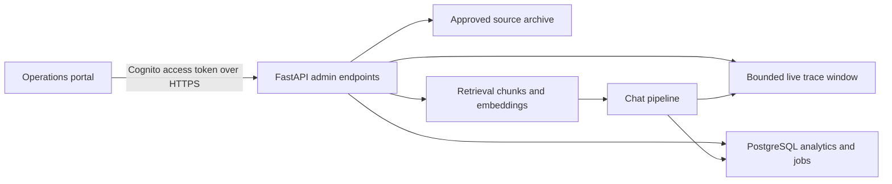

# AskVera Operations Portal

## Purpose

This package gives stakeholders one simple interface for understanding how AskVera works and gives administrators practical tools to improve it. It is country-independent: market and language metadata come from the existing market configuration instead of country-specific code paths.

## System flow

```mermaid
flowchart LR
    Browser["Operations portal"] -->|"Cognito access token over HTTPS"| API["FastAPI admin endpoints"]
    API --> Trace["Bounded live trace window"]
    API --> RDS["PostgreSQL analytics and jobs"]
    API --> S3["Approved source archive"]
    API --> OpenSearch["Retrieval chunks and embeddings"]
    Chat["Chat pipeline"] --> Trace
    Chat --> RDS
    OpenSearch --> Chat
```

The live flow uses the actual metrics emitted by request received, governance, retrieval, prompt build, model generation, validation, response build, and response delivered. It exposes timings, result counts, confidence, and failure signals without exposing prompts, retrieved passages, secrets, or full session history. Common email and phone patterns are redacted from trace previews and stored analytics questions.

## Admin API

All routes require a Cognito access token from a member of the configured administrator group and return the normal AskVera success envelope. A separately managed API key can be enabled for local development or controlled break-glass access, but it is disabled in the production website configuration.

| Route | Purpose |
| --- | --- |
| `GET /api/admin/config` | Markets, languages, document types, scopes, and upload limit |
| `GET /api/admin/traces` | Recent live pipeline traces |
| `GET /api/admin/traces/{id}` | One trace with ordered stages |
| `GET /api/admin/analytics/overview` | Aggregate metrics and trend data |
| `GET /api/admin/analytics/interactions` | Answer-level quality review |
| `GET /api/admin/ingestions` | Recent document jobs and status |
| `POST /api/admin/documents` | Validate and queue an approved document |
| `GET/POST/PATCH /api/admin/users` | Feature-gated administrator lifecycle and scopes |
| `POST /api/admin/users/{id}/enable` | Re-enable a disabled administrator |
| `POST /api/admin/users/{id}/disable` | Immediately block an administrator |
| `POST /api/admin/users/{id}/resend-invite` | Ask Cognito to send a new invitation |
| `GET/PUT /api/admin/support-routes` | View or update country-specific support destinations |
| `GET /api/admin/audit-events` | Recent administrator changes |
| `GET/POST/PATCH /api/admin/widgets` | Feature-gated widget instance management |
| `POST /api/admin/widget-assets` | Validate and upload a widget logo |
| `POST /api/admin/widgets/{id}/rotate-key` | Rotate the public widget identifier |
| `POST /api/admin/widgets/{id}/disable` | Disable a widget instance |

The Users view is paginated and can be filtered by status. Disabled accounts
show when they were disabled. Country administrators may only view or update
support destinations for their assigned markets; Super Admins can manage every
market. Support submissions use a managed database route when one exists and
fall back to the existing SSM configuration until routes are migrated.

Widget logos are limited to PNG, JPEG, and WebP files up to 1 MB. The API
validates the file signature, stores the object under the configured widget
asset prefix, and only accepts saved logo URLs from that configured public
origin.

## Source links

The public widget never receives a permanent S3 URL. When a user selects
`View exact source`, it requests `POST /api/source-link` with the current
session, market, language, source URI, and page. The API verifies:

1. The widget token belongs to the same session.
2. The session has valid consent.
3. The source is active and approved in the retrieval database.
4. A country document matches the selected market and language, or the source
   is explicitly global.
5. The S3 object is under the approved knowledge bucket.

Only then does the API return a five-minute presigned URL. A PDF page fragment
is added when the citation contains a page number.

Analytics are captured from the existing chat and feedback routes. The question text is locally redacted for common email and phone patterns, answers have already passed output PII controls, and session IDs are used only for distinct-user aggregation. Apply the organization's retention policy to `chat_analytics` and `feedback_events` before production launch.

When RBAC is enabled, every portal route enforces section permission and
market scope on the server. An unfiltered Insights request from a country
administrator is aggregated only across that administrator's assigned
markets. Browser-side hiding is a usability aid and is never the security
boundary.

## Knowledge ingestion

1. Validate extension, size, country, language, type, and scope.
2. Save a short-lived local working copy and create a durable job record.
3. Extract readable text from PDF, DOCX, text, Markdown, CSV, or HTML.
4. Split by generic headings and then into overlapping 4,500-character chunks.
5. Archive the approved original in S3 when a bucket is configured.
6. Generate embeddings and bulk-index the chunks in OpenSearch.
7. Only after the new load succeeds, remove older active chunks for the same market, language, and filename.

Country-scoped documents follow the chatbot's locale filter. Global documents are available to every country but still obey the requested language (including the configured English fallback). Failed extraction or indexing remains visible in the job list and never replaces an older working source.

## Production checklist

- Use Cognito authorization-code flow with PKCE and restrict access to `AskVeraAdmins`.
- Keep `ADMIN_AUTH_ALLOW_API_KEY=false` in normal production operation.
- Set `ADMIN_BOOTSTRAP_SUPER_ADMIN_EMAIL` to the approved initial administrator
  before enabling RBAC. Do not use a shared mailbox for this role.
- Grant the API instance role the scoped Cognito actions needed for user
  lifecycle management, including `AdminAddUserToGroup`. New and re-invited
  portal users are added to the configured required group automatically.
- Keep at least two individually assigned Super Admins after initial setup.
  AskVera prevents self-disable, self-demotion, and removal of the last active
  Super Admin.
- Set `KNOWLEDGE_UPLOAD_BUCKET` to a private, encrypted, versioned S3 bucket with lifecycle and least-privilege IAM policies.
- Set `WIDGET_ASSET_BUCKET` and `WIDGET_ASSET_PUBLIC_BASE_URL`, and grant only
  `s3:PutObject` for the `widget/assets/logos/` prefix to the API role.
- Add the widget asset origin to the admin portal CloudFront content-security
  policy so uploaded-logo previews can render.
- Add the operations portal HTTPS origin to `ALLOWED_ORIGINS`; do not use a wildcard.
- Federate the Cognito user pool with company SSO when the identity team is ready; the built-in user pool supports the initial controlled launch.
- Configure CloudFront security headers and no-store caching for the portal shell.
- Confirm PostgreSQL backups and define retention for analytics, feedback, ingestion jobs, and document records.
- Add OCR (for example an asynchronous Textract worker) before accepting image-only scanned PDFs.
- For multiple API workers, move the short live-trace window to shared Redis or an event stream so every portal poll sees the same active request.
- Managed widget edits use Valkey to invalidate authorization and origin caches
  across API workers. Monitor `widget_registry_invalidation_*` log events; the
  local authorization cache is capped at 30 seconds as a fallback.
- Run unit tests, build the portal, perform a real upload in a non-production index, and verify a chat retrieves the new content before production deployment.
- Apply `migrations/20260729_01_operations_admin.sql` before enabling support
  route management or widget logo persistence.
- Seed and verify each market's support route before treating managed routing
  as authoritative. Keep the SSM routes in place during the transition.
- Confirm `POST /api/source-link` is protected by widget authentication,
  consent, and the configured per-minute rate limit.
- Apply the three `20260728_*` additive migrations before enabling the related
  flags.
- Keep all optional enhancement flags disabled until the corresponding UAT
  acceptance test has passed.

## Deployment boundary

The portal is packaged for production deployment in `deployment/admin-portal.yaml`. The stack creates private S3 hosting, CloudFront, security headers, Cognito and the administrator group. DNS, the ACM certificate, initial administrator membership, API SSM values, and the exact CORS origin remain controlled deployment inputs.
